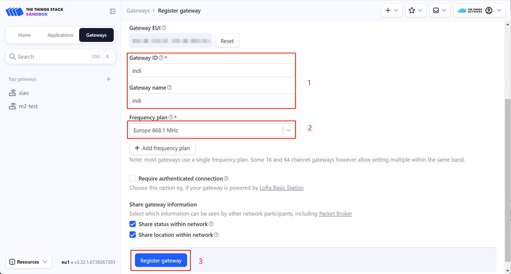

# SenseCAP Indicator LoRaHub Demonstrations
============================================================

This project demonstrates how to implement a single channel LoRa gateway (LoRaHub)
using SenseCAP Indicator.

This project contains the following components:
* `components/liblorahub`: the Hardware Abstraction Layer (HAL) on top of the radio driver.
* `components/radio_drivers`: the sx126x, llcc68, lr11xx radio drivers and associated hardware abstraction layer.
* `components/smtc_ral`: the radio abstraction layer and board/shields definitions.
* `lorahub/main`:
	* a packet forwarder implementation to connect the LoRaHub to a LoRaWAN network server, using Semtech UDP protocol (see PROTOCOL.md file).
	* connectivity and configuration: an example implementation for WiFi provisioning and LoRaHub configuration through a touchscreen display.

# 1. Components

## 1.1. liblorahub

The Hardware Abstraction Layer (HAL) sits on top of the radio driver to and aims
to handle proper configuration for RX and TX for LoRaHub needs.

The HAL API is similar to what already exists for LoRa gateways (sx130x), it
exposes the following functions:
* `lgw_rxrf_setconf()`: set radio parameters
* `lgw_rxif_setconf()`: set modulation parameters
* `lgw_start()`: connect the host to the radio (SPI) and configure the radio for RX
* `lgw_stop()`: stop the radio
* `lgw_receive()`: check for received packet
* `lgw_send()`: send a packet and configure the radio back to RX after TX done
* `lgw_status()`: returns current LoRaHub status (free, emitting, ...)
* `lgw_get_instcnt()`: returns the current LoRaHub counter value
* `lgw_time_on_air()`: computes the time on air of a packet

The HAL is responsible for timestamping the received uplinks as precisely as
possible in order to allow the network to send a downlink in time back to an
end-device.
For this, the HAL configures the radio to raise an interrupt when a packet is
received. When this interrupt is raised, the HAL just gets the LoRaHub counter
value and returns. The received packet is actually retrieved when the user calls
lgw_receive().

## 1.2. radio drivers & hal

This project relies on the official Semtech's radio drivers for sx126x, llcc68
and lr11xx radio chips.

The drivers are available on Github:
* https://github.com/Lora-net/sx126x_driver
* https://github.com/Lora-net/llcc68_driver
* https://github.com/Lora-net/SWDR001

As usual, a radio HAL is implemented to define how to interact with the radios
depending on the platform it is used with (reset, SPI transfer, ...).

The Semtech Radio Abstraction Layer (smtc_ral) is also provided to abstract
radio usage.


# 2. Application
## 2.1 Indicator Configuration
1. Enter the Wi-Fi page to configure the network, select the appropriate SSID, and enter the password.
<p align="center">
  
</p>

2. Configure the parameters on the LoRa Gateway page, click "configure," and then click "reboot."

<p align="center">
  
</p>


## 2.2 The Things Network Configuration
1. Log in to the TTN platform and go to the `console`, click `Gateways->Register gateway`.

2. Enter the `Gateway ID` of the Indicator into the `Gateway EUI`.

3. After filling in the custom gateway name, select the corresponding Frequency plan (which must match the configuration on the Indicator), and click `Register gateway`. At this point, the single-channel gateway of the Indicator has been added to TTN.


4. After adding the Indicator single-channel gateway, click `Applications` to add a device. In this example, the `SenseCAP T1000 Tracker` is used as the node device. For detailed connection steps, refer to the Wiki: https://wiki.seeedstudio.com/SenseCAP_T1000_tracker_TTN/. In `End devices`->`General settings`->`Network layer`->`Advanced MAC settings`, you need to set the `Adaptive data rate (ADR)` to **Static mode**, and the `ADR data rate index` needs to be configured according to the `spreading factor` set on the Indicator. For example, if the `spreading factor` is set to 9, the `ADR data rate index` should be set to 3, and similarly for other values.


5. As shown below, you can check the `EVENT DETAILS` in the Live data of the added node device to view related logs. You can see that the node device reports data through the newly added Indicator single-channel gateway.


# 3. Usage

This project comes with precompiled binaries that can be flashed on the
supported platforms listed above.

For flashing without the ESP-IDF installed, skip directly to the "flash with
esptool" section below.

For each supported platform/radio, the following binary files are provided:
* `Indicator_Lorahub_v1.0.0.bin`: indicator_lorahub firmware

## 3.1. Install environment

This project is based on the Espressif ESP-IDF development. As such, the
following guide can be used to setup the environment.

https://docs.espressif.com/projects/esp-idf/en/stable/esp32/get-started/index.html#installation

Please note that the following instructions are for a linux setup. It may
slightly differ with a Windows setup.

## 3.2. Build
Get the radio drivers:

```console
cd ~/this_project_directory/components/radio_drivers
```

* sx126x driver (sx1261, sx1262, sx1268):

```console
git clone -b v2.3.2 https://github.com/Lora-net/sx126x_driver.git sx126x_driver
```

* llcc68 driver:

```console
git clone -b v2.3.2 https://github.com/Lora-net/llcc68_driver.git llcc68_driver
```

* lr11xx driver (lr1121):

```console
git clone -b v2.4.1 https://github.com/Lora-net/SWDR001.git lr11xx_driver
```

Enter the lorahub directory.

```console
cd ~/this_project_directory/lorahub
```

Prepare your Linux terminal for building with ESP-IDF from the command line.
This step can be skipped on Windows as the installed 'ESP-IDF x.x CMD' tool will
prepare the environment automatically.

```console
. ~/esp/esp-idf/export.sh
```

Configure the ESP32 target to build for.

```console
idf.py set-target esp32s3
```

Customize the build if necessary (it is configured for the Heltec board by default).

```console
idf.py menuconfig
```

Build the project.

```console
idf.py all
```

## 3.3. Flash
### 3.3.1 with esp-idf
Identify the serial device associated to the LoRaHub to be flashed, here we
suppose it is `/dev/ttyUSB0`.

```console
idf.py -p /dev/ttyUSB0 flash
```

If a permission error is returned, check check that the current user is part of
the `dialout` group. If not, do the following, reboot the linux machine and try
again:

```console
sudo usermod -a -G dialout $USERNAME
```

On a Windows setup, let's suppose that the device is mounted as COM14, the above
command would be like:

```console
idf.py -p COM14 flash
```

Launch the monitor console to see logs (optional).

```console
idf.py -p /dev/ttyUSB0 monitor
```

### 3.3.2 with esptool

If not using the complete ESP-IDF environment, it is also possible to flash the
provided binary files using the `esptool` utility.

https://docs.espressif.com/projects/esptool/en/latest/esp32/

```console
esptool.py --chip esp32s3 -p /dev/ttyUSB0 -b 460800 --before=default_reset --after=hard_reset write_flash --flash_mode dio --flash_freq 80m --flash_size 8MB 0x0 Indicator_Lorahub_v1.0.0.bin
```

On a Windows setup the esptool command for flashing would be:

```console
py -m esptool --chip esp32s3 -p COM14 -b 460800 --before=default_reset --after=hard_reset write_flash --flash_mode dio --flash_freq 80m --flash_size 8MB 0x0 Indicator_Lorahub_v1.0.0.bin
```

# 4. Known limitations

* FSK modulation not supported