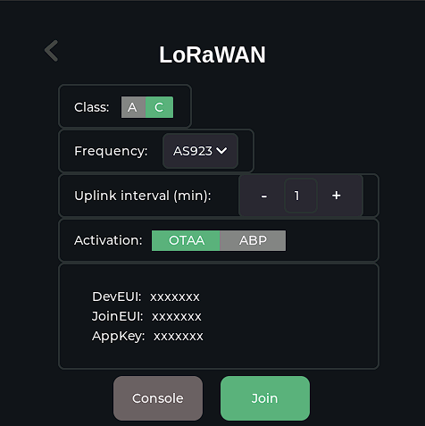

# SenseCAP Indicator LoRaWAN Demo

## Introduction
The SenseCAP Indicator LoRaWAN Demo, developed for the ESP32 platform, showcases the application of LoRaWAN technology in environmental monitoring. It provides a user-friendly interface for managing LoRaWAN network connections and transmitting sensor data.

## Usage

The LoRaWAN screen is the user's gateway to control the device's network connection activities. It automates the connection to the LoRaWAN network and efficiently transmits captured sensor data.

### Console Commands
To adjust device settings, use the `lorawan` command in the console. This command allows you to set essential parameters like EUI, Join EUI, and App Key, crucial for connecting and authenticating your device with a LoRaWAN network.


### Examples
```sh
lorawan --eui <Your_EUI> --join_eui <Your_Join_EUI> --app_key <Your_App_Key>
```
1. **Set EUI**:
   ```sh
   lorawan --eui 0004A30B001C0530
   ```
   This sets the EUI of your device.

2. **Set Join EUI and App Key**:
   ```sh
   lorawan --join_eui 70B3D57ED0007E4A --app_key 8AFE71A145B253E49C3031AD06827777
   ```
   Use this to set the Join EUI and App Key for network authentication.