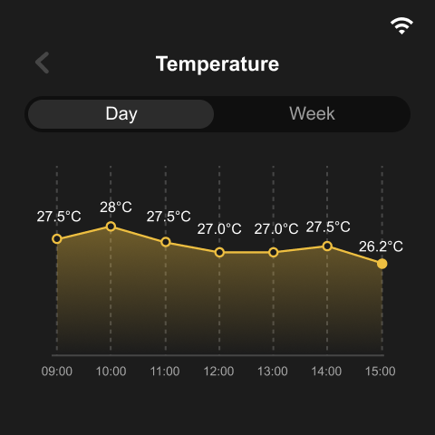

# Indicator Matter Demo

This demo builds off of the indicator basis demo to implement the Matter 1.0 specification for tracking of the associated sensor data. In addition the demo provides a pull down virtual interface for enabling some Matter device elements.

In the case of this demo it does such by implementing two light dimmer devices and a door lock device.

This demo mainly implements time, sensor data display, and some configuration functions.

<figure class="third">
     
    
</figure>

## Function
- [x] Matter configuration
- [x] Home assistant dashboard
- [x] Time display.
- [x] CO2, tVOC, Temperature and Humidity data real-time display.
- [x] CO2, tVOC, Temperature and Humidity history data display.
- [x] Wifi config.
- [x] Display config.
- [x] time config.

## How to use example

Please first read the [User Guide](https://wiki.seeedstudio.com/SenseCAP_Indicator_Get_Started) of the SenseCAP Indicator Board to learn about its software and hardware information.

### Dependencies

In order to build this project you will need an environment setup to build esp-matter applications. Please read the [install guide](https://docs.espressif.com/projects/esp-matter/en/latest/esp32/developing.html) from Espressif to get your machine ready for installation.

#### Versions

The following library versions were used for this example:
- esp-idf: v5.0.1
- esp-matter: v1.1

#### Preparing your environment

1. Install esp-idf 5.0.1
2. Install the patch as mentioned below in the build and flash section for the 120M Octal PSRAM
3. Install esp-matter
4. Export your environment for esp-idf and matter
5. Build, flash, and (optionally) monitor the deployment

#### Build and Flash

1. The project configure PSRAM with Octal 120M by default. please see [here](../../tools/patch/README.md#idf-patch) to enable `PSRAM Octal 120M` feature.
2. Run `idf.py -p PORT flash monitor` to build, flash and monitor the project.

(To exit the serial monitor, type ``Ctrl-]``.)

See the [Getting Started Guide](https://docs.espressif.com/projects/esp-idf/en/latest/get-started/index.html) for full steps to configure and use ESP-IDF to build projects.
