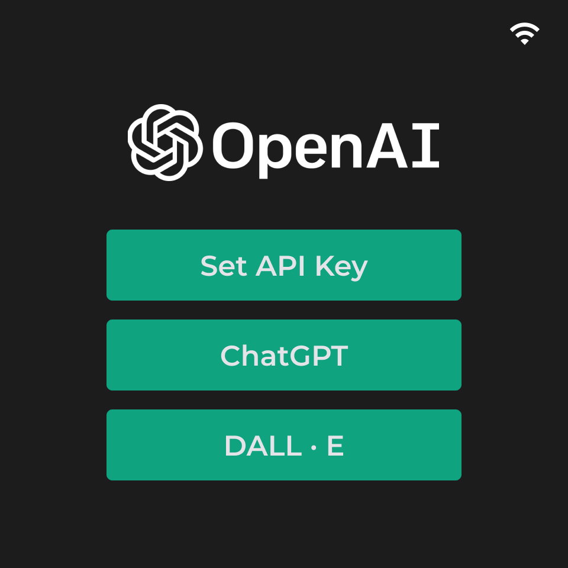
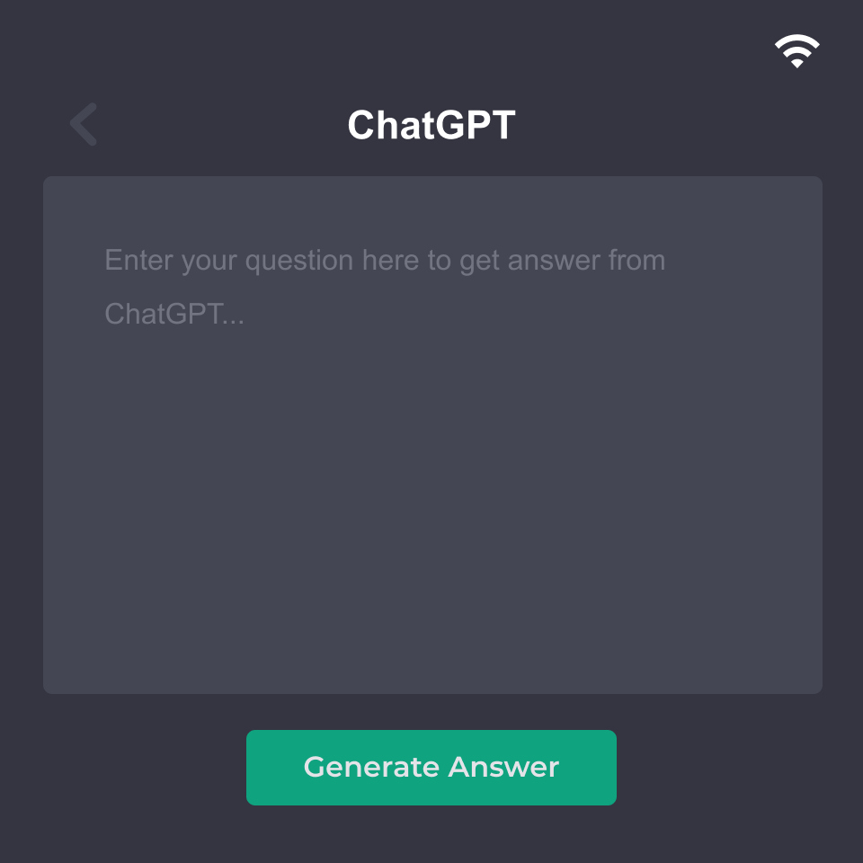
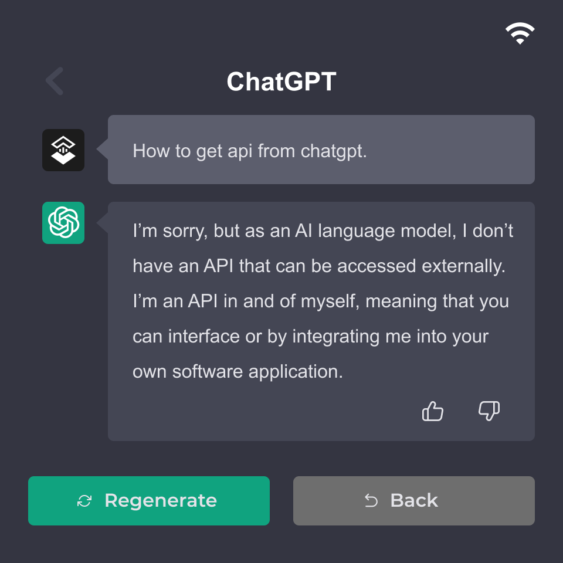

# Indicator OpenAI Demo

This demo is mainly based on the indicator_basis demo with added chartGPT and DALL•E functions.

<figure class="third">
    
    
    
    
    
</figure>

## Function
- [x] Time display.
- [x] CO2, tVOC, Temperature and Humidity data real-time display.
- [x] CO2, tVOC, Temperature and Humidity history data display.
- [x] Wifi config.
- [x] Display config.
- [x] time config.
- [x] chatGPT
- [x] DALL E2

## How to use example

Please first read the [User Guide](https://wiki.seeedstudio.com/Sensor/SenseCAP/SenseCAP_Indicator/Get_started_with_SenseCAP_Indicator) of the SenseCAP Indicator Board to learn about its software and hardware information.

When using openai-related functions, you must first set the openai api key through the esp32 serial port.

```
openai_api -k <your key>
```


### Build and Flash

1. The project configure PSRAM with Octal 120M by default. please see [here](../../tools/patch/README.md#idf-patch) to enable `PSRAM Octal 120M` feature. 
2. Run `idf.py -p PORT flash monitor` to build, flash and monitor the project.

(To exit the serial monitor, type ``Ctrl-]``.)

See the [Getting Started Guide](https://docs.espressif.com/projects/esp-idf/en/latest/get-started/index.html) for full steps to configure and use ESP-IDF to build projects.
