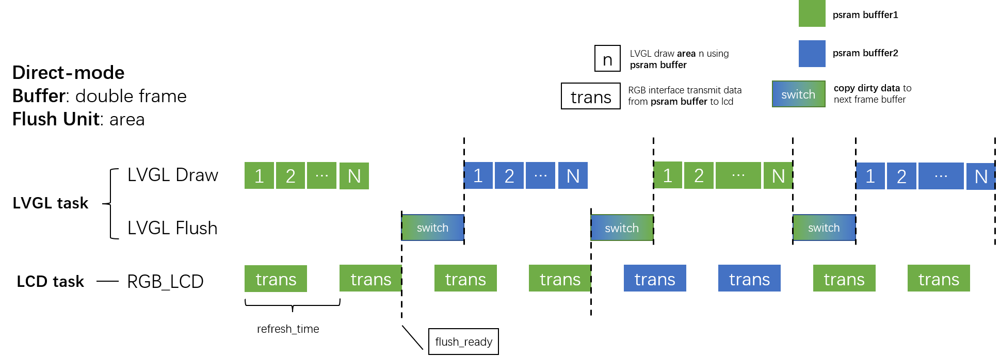

# LVGL Demos Example

An example used to run LVGL's internal demos on ESP32-S3-LCD-EV-Board. Includes music player, widgets, stress, benchmark, printer and tuner.

This example alse shows two methods to avoid tearing effect. It uses two frame buffers and semaphores based on LVGL **buffering modes**. For more information about this, please refer to official [LVGL buffering-mode](https://docs.lvgl.io/master/porting/display.html?#buffering-modes). The implementation principles of them are shown as follows:

## Full-refresh

## Direct-mode

## How to use example

### Hardware Required

* An ESP32-S3-LCD-EV-Board development board
* An USB Type-C cable for Power supply and programming

### Configure

Run `idf.py menuconfig` and go to `Board Configuration`:

1. Based on hardware to `Select LCD Sub Board` and related configuration.
2. Set `Frequency of lcd pclk`
3. Choose whether to `Avoid tearing effect`
4. Chosse to `Select lvgl mode for avoiding tearing` (available only when step `3` was chosen to true)
5. Set `Priority of lcd refresh task` (available only when step `3` was chosen to true)
6. Set `Screen refresh period(ms)` (available only when step `3` was chosen to true)

### Build and Flash

Run `idf.py -p PORT flash monitor` to build, flash and monitor the project.

(To exit the serial monitor, type ``Ctrl-]``.)

See the [Getting Started Guide](https://docs.espressif.com/projects/esp-idf/en/latest/get-started/index.html) for full steps to configure and use ESP-IDF to build projects.

## Example Output

Run the example, you will see an example of LVGL's internal demos, default is music player.

## Performance Test

### Test Environment

| Params                    | Value                             |
|:-------------------------:|:---------------------------------:|
| Pclk of RGB LCD           | 18M                               |
| Version of ESP-IDF        | master (id: f3159) + 120M_patch   |
| Configuration of PSRAM    | Octal, 120M                       |
| Version of LVGL           | v8.2                              |
| Test Demo of LVGL         | Music player                      |

### Description of Buffering Mode

| Buffering Mode | Description                                      |
|:--------------:|:------------------------------------------------:|
| Mode1          | One buffer with 64-line heights in internal sram |
| Mode2          | One buffer with frame-size in psram              |
| Mode3          | Full-refresh with two frame-size psram buffers   |
| Mode4          | Direct-mode with two frame-size psram buffers    |

### Average FPS with 480x480

| Buffering Mode | LCD refresh period: 20ms |  LCD refresh period: 30ms |  LCD refresh period: 40ms |
|:--------------:|:------------------------:| :------------------------:| :------------------------:|
| Mode1          | 25                       |  25                       |  25                       |
| Mode2          | 23                       |  23                       |  23                       |
| Mode3          | 21                       |  22                       |  24                       |
| Mode4          | 21                       |  22                       |  22                       |

Note: Mode1 and Mode2 are not controlled by LCD refresh period.

### Average FPS with 800x480

| Buffering Mode | LCD refresh period: 20ms |
|:--------------:|:------------------------:|
| Mode1          | 23                       |
| Mode2          | 19                       |
| Mode3          | 18                       |
| Mode4          | 17                       |

Note: Since 800x480 LCD will flicker obviously in a longer refresh period, the rest tests are not conducted.

## Troubleshooting

* Program upload failure
    * Hardware connection is not correct: run `idf.py -p PORT monitor`, and reboot your board to see if there are any output logs.
    * The baud rate for downloading is too high: lower your baud rate in the `menuconfig` menu, and try again.
    * Error message with `A fatal error occurred: Could not open /dev/ttyACM0, the port doesn't exist`: Please first make sure development board connected, then make board into "Download Boot" mode to upload by following steps:
        1. keep press "BOOT(SW2)" button
        2. short press "RST(SW1)" button
        3. release "BOOT(SW2)".
        4. upload program and reset
* LCD screen drift
  * Slow down the PCLK frequency
  * Adjust other timing parameters like PCLK clock edge (by `pclk_active_neg`), sync porches like VBP (by `vsync_back_porch`) according to your LCD spec
  * Enable `CONFIG_SPIRAM_FETCH_INSTRUCTIONS` and `CONFIG_SPIRAM_RODATA`, which can saves some bandwidth of SPI0 from being consumed by ICache.
* LCD screen tear effect
    * Using avoid tearing effect.
* LCD screen flickering after enable avoid tearing effect
    * Set lower screen refresh period.

## Technical support and feedback

Please use the following feedback channels:

* For technical queries, go to the [esp32.com](https://esp32.com/) forum
* For a feature request or bug report, create a [GitHub issue](https://github.com/espressif/esp-dev-kits/issues)

We will get back to you as soon as possible.
